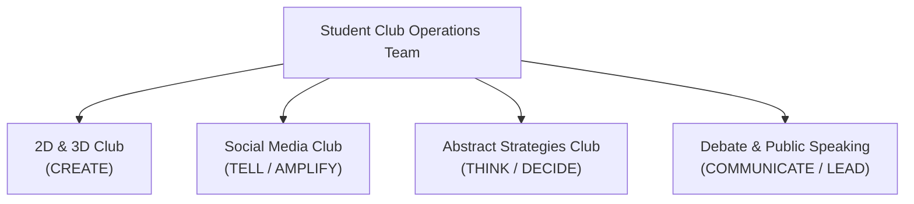

# About the Ecosystem

The **Kalvium × Vels Student Clubs** initiative represents a collaborative co-curricular framework designed to foster innovation, leadership, and peer-to-peer execution across the campus.

---

## 📌 Background & Context

Modern tech, design, and business landscapes require professionals who excel not only in technical domain skills, but also in visual representation, strategic execution, media literacy, and persuasive communication. 

The Student Clubs ecosystem bridges academic concepts and industry demands by providing structured **Growth Hours** where students collaborate across batches and specialization tracks.

---

## 🏛️ Ecosystem Structure

The ecosystem comprises four pillar clubs, coordinated by a central Operations Team:

Each club functions as an autonomous unit led by a student **President**, **Vice President**, and **Club Coordinators**, supported by a dedicated faculty **Mentor**.
