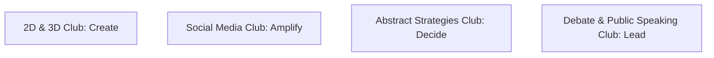

# About the Ecosystem

The Student Clubs ecosystem brings together creative, analytical, and technical disciplines into four distinct clubs.

Each club operates independently under student leadership, supported by a faculty mentor.
