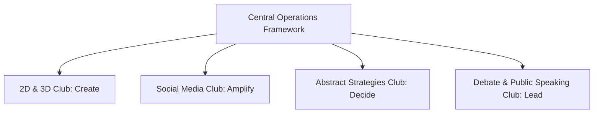

# About the Ecosystem

The Kalvium x Vels Student Clubs initiative brings together four distinct focus areas under a unified campus framework.

Each club functions as an independent team with its own leadership, activities, and project style. The ecosystem exists to make sure every club has access to campus facilities, dedicated Growth Hours, and fair opportunities to showcase their achievements.
