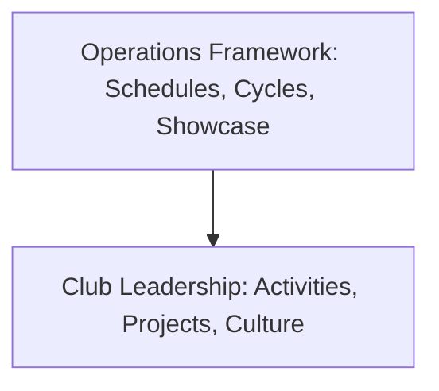

# How Clubs Work

The central framework sets the boundaries that make the ecosystem work consistently, while club leadership decides how their club operates within those boundaries.

## Central Framework Responsibilities

The framework defines common rules: what clubs exist, enrollment procedures, the One-Club-Only rule, the monthly Club Cycle, Showcase Day, the Club Switching Window, basic leadership roles, and Growth Hours timing.

## Club Leadership Autonomy

Club leaders decide what happens inside their sessions. This includes choosing weekly workshop topics, project themes, discussion topics, internal task assignments, and how the team prepares for Showcase Day.

This structure ensures that four very different clubs can develop their own unique identities without being forced into a rigid, one-size-fits-all format.
