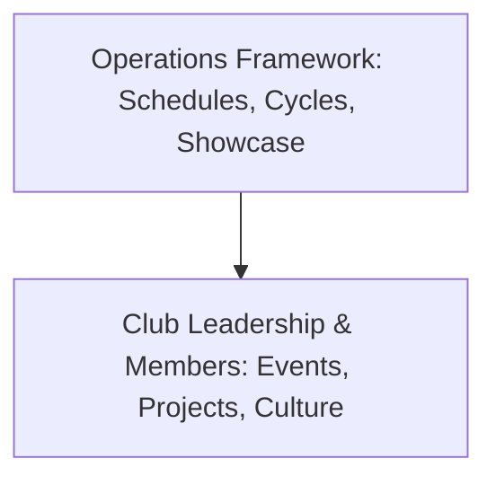

# How Clubs Work

The central framework sets the boundaries that make the ecosystem work consistently, while club leaders and members decide how their club operates within those boundaries.

## Diversity of Activities

A Club Cycle is not restricted to a single project or a rigid weekly template. Within a cycle, clubs may engage in a mix of activities:

- Events: Workshops, competitions, challenges, guest talks, debates, creative sessions, and games.
- Projects: Individual, team, short-term, or multi-week creative or technical builds.
- Individual Learning: Independent skill practice, tool exploration, and personal portfolio work supported by peer feedback.
- Collaborative Activities: Brainstorming sessions, practice challenges, peer teaching, and group exercises.
- Showcase Preparation: Organizing completed work, demonstrations, or performances for Showcase Day.

This flexibility ensures that every club can adapt its schedule to the interests and creative ideas of its members.
