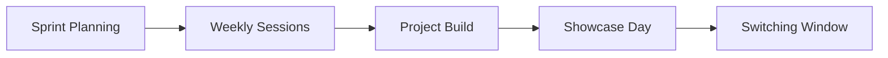

# How Clubs Work

Each club operates through repeating monthly cycles. Clubs focus on active building, discussions, and skill development rather than lectures.

At the start of the month, club leaders define a sprint goal. Members spend weekly Growth Hours working toward that goal, presenting their completed work on Showcase Day.
