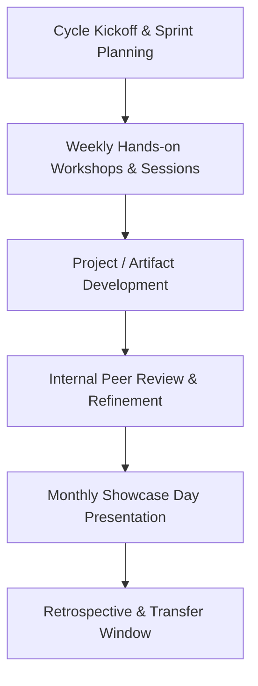

# How Clubs Work

Each club within the ecosystem operates as an active, project-focused working group rather than a passive interest group. 

---

## 🔄 The Monthly Club Lifecycle

Every club structures its activities around a repeating monthly cycle focused on practical outputs:

---

## 🛠️ Operating Principles

1. **Action Over Theory**: Sessions are built around active creation, live debates, gameplay analysis, or content production.
2. **Mentorship Oversight**: Faculty mentors review monthly sprint roadmaps but empower student officers to lead execution.
3. **Structured Ownership**: Club Presidents and VPs manage session agendas, attendance tracking, and showcase preparations.
4. **Transparent Deliverables**: Every sprint culminates in demonstrable artifacts uploaded to official club archives.
