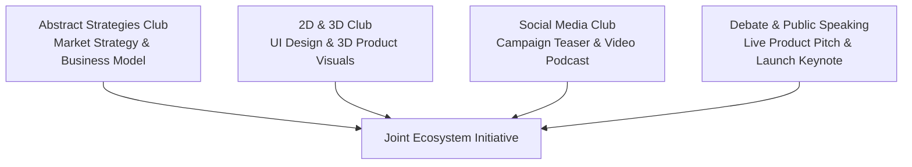

# Inter-Club Collaboration

While every student belongs to exactly **ONE** club at a time under the [One-Club-Only Policy](../05-membership/one-club-rule.md), real-world projects frequently require cross-disciplinary collaboration.

---

## 🤝 The Collaborative Framework

The ecosystem encourages clubs to form joint project alliances for major events or showcase sprints. This mirrors cross-functional product teams in technology companies:

---

## 📋 Collaboration Rules

1. **Roster Integrity**: A student participating in a joint project remains exclusively enrolled in and accountable to their home club's roster.
2. **Clear Attribution**: Credit for joint showcase artifacts must explicitly acknowledge all contributing clubs and individual student roles.
3. **Coordinated Schedules**: Joint sessions must be planned well in advance and approved by the Presidents of all participating clubs during sprint planning.
