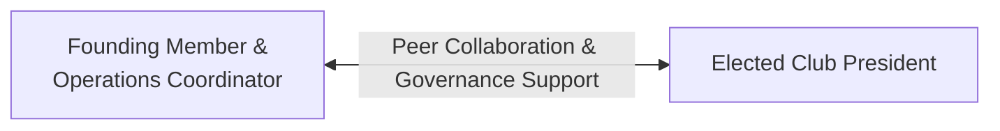

# Operations Coordinators

Members of the central Operations Team who established and maintain the ecosystem hold the official designation:

**Founding Member & Operations Coordinator**

---

## ⚖️ Equality of Designation & Authority

To prevent administrative friction and foster a collaborative spirit, all founding members of the Operations Team operate under an equal designation. 

- **No Internal Hierarchy**: No single Operations Coordinator holds superior administrative rank over another within the Operations Team.
- **Equal Voice**: Decisions within the Operations Team are made consensus-wise or via majority vote.

---

## 🤝 Relationship with Elected Club Presidents

> [!IMPORTANT]
> The designation of Operations Coordinator **does NOT confer authority over elected Club Presidents**. Operations Coordinators act as facilitators and operational partners—not managers—to elected club leaders.
