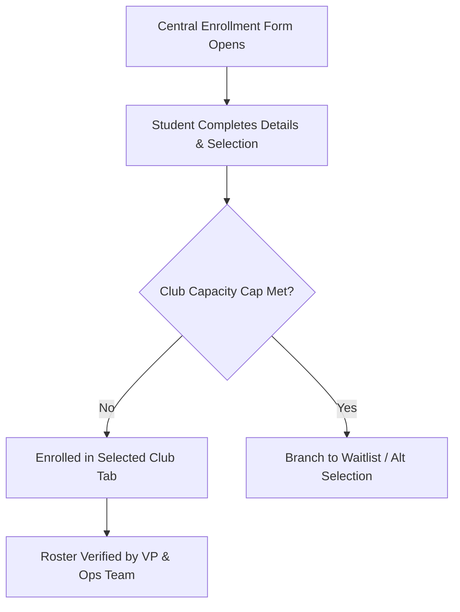

# Enrollment & Roster Management

The ecosystem maintains strict roster tracking to ensure active participation, safety compliance, and proper resource management.

---

## 📋 Enrollment Workflow

---

## 🛡️ Roster Maintenance Rules

1. **Active Roster Verification**: Club Vice Presidents must update and submit verified active member lists to the Operations Team at the end of each sprint cycle.
2. **Capacity Cap Enforcement**: Clubs with facility limitations (e.g., specialized graphics labs for 2D & 3D) automatically enforce capacity caps via Google Forms logic.
3. **Inactive Status Cleanup**: Members missing two consecutive unexcused club sessions are marked inactive and notified prior to roster pruning.
