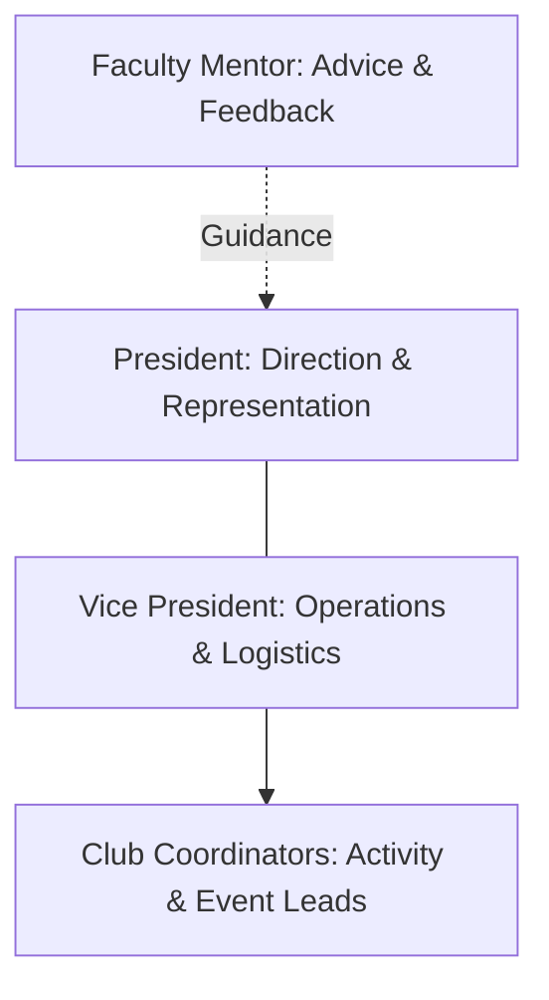

# Leadership Structure & Roles

Each club is led by a student executive team consisting of a President, Vice President, and Club Coordinators, supported by a Faculty Mentor.

## Role Responsibilities

### President

The President provides direction for the club and is responsible for ensuring that the club remains active, purposeful, and aligned with its identity.

- Setting the direction for each cycle in consultation with members.
- Working closely with the Vice President and Club Coordinators.
- Planning the club's activities, events, and workshops.
- Ensuring members have meaningful opportunities to contribute.
- Coordinating Showcase Day presentations and outputs.
- Representing the club when required.
- Coordinating with the Faculty Mentor.
- Supporting the club's long-term development.
- Participating in cycle retrospectives.

### Vice President

The Vice President supports the President and helps ensure the club operates smoothly.

- Supporting cycle planning and execution.
- Coordinating activities, workshops, and events.
- Helping organize members and task responsibilities.
- Maintaining continuity when the President is unavailable.
- Supporting Showcase Day preparation.
- Helping maintain participation and activity records.
- Supporting club switching coordination when required.
- Assisting with weekly and monthly reporting.

### Club Coordinators

Club Coordinators take ownership of specific responsibilities, activities, or events within the club.

- Leading specific workshops, practice sessions, or tutorials.
- Coordinating events, competitions, or challenges.
- Managing project sub-teams or activity groups.
- Supporting members during Growth Hours sessions.
- Taking ownership of assigned tasks.
- Assisting with club documentation and reporting.

## Selection & Succession

Leadership positions are filled through transparent selection periods based on commitment, organizational capability, and initiative. Interested members submit an application detailing their background and ideas for upcoming club cycles. Candidates complete a review with the Operations Team and Faculty Mentors before appointments are finalized.

## Current Club Leadership & Mentors

The following individuals represent the current leadership and mentorship team for each club. These listings represent active appointments and may change through future elections, appointments, or succession.

### 2D & 3D Club

- Current Mentor: Nitheesh Kumar
- Current President: To Be Assigned
- Current Vice President: To Be Assigned
- Current Club Coordinators: To Be Assigned

### Social Media Club

- Current Mentor: Sibishree M
- Current President: To Be Assigned
- Current Vice President: To Be Assigned
- Current Club Coordinators: To Be Assigned

### Abstract Strategies Club

- Current Mentor: Varshaa KK
- Current President: To Be Assigned
- Current Vice President: To Be Assigned
- Current Club Coordinators: To Be Assigned

### Debate & Public Speaking Club

- Current Mentor: G S Sai Priya
- Current President: To Be Assigned
- Current Vice President: To Be Assigned
- Current Club Coordinators: To Be Assigned
