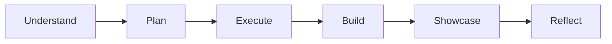

# Leadership Deliverables & Model

While club leadership has freedom over creative choices, all leaders follow a common operating method to guide their club through each cycle:

Understand -> Plan -> Execute -> Build -> Showcase -> Reflect

## Understand

At the beginning of a cycle, leadership should understand the members, their interests, abilities, availability, and the direction they want the club to take.

## Plan

The leadership team decides what the club will work on during the cycle. This may include activities, projects, workshops, discussions, challenges, or other experiences relevant to the club.

## Execute

Leadership coordinates the club's activities and ensures members have meaningful opportunities to participate and contribute. The President and Vice President coordinate rather than personally doing everything.

## Build

The club works toward something tangible that can represent its work during Showcase Day. What that output is should be decided by the club leadership.

## Showcase

Leadership coordinates the final presentation or demonstration of the club's work on Showcase Day.

## Reflect

After the cycle, leadership reviews what worked, what did not, what members responded to, and what should change in the next cycle.
