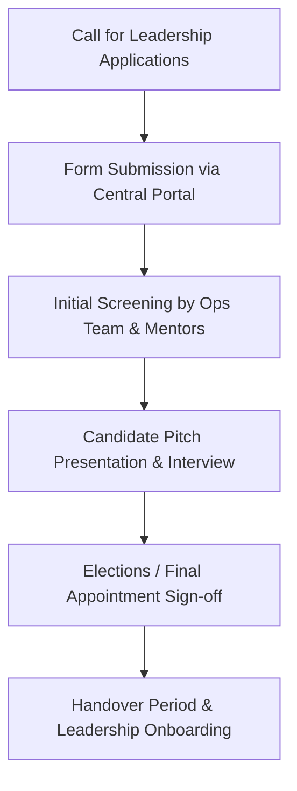

# Selection & Succession Process

Leadership positions are earned through transparent selection processes based on merit, commitment, and vision.

---

## ⏳ Selection Timeline & Workflow

---

## 📋 Evaluation Criteria

1. **Proven Commitment**: Active attendance and contribution history in previous club cycles.
2. **Organizational Capability**: Ability to manage timelines, communicate clearly, and coordinate team members.
3. **Technical / Domain Skill**: Relevant competence in the club's core discipline (design, media, strategy, public speaking).
4. **Vision & Plan**: Clear ideas for upcoming monthly sprints and showcase projects.

> [!NOTE]
> Expressing interest in leadership during enrollment does **not** guarantee appointment. Officers undergo periodic performance reviews at the end of each term.
