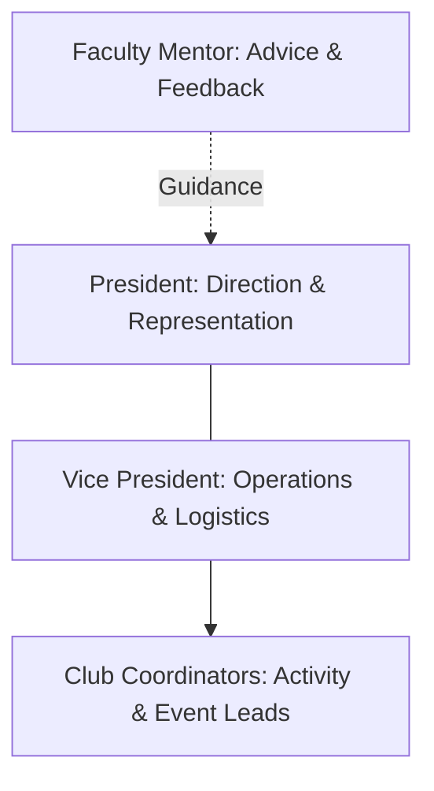

# Leadership Structure

Each club is led by a student executive team consisting of a President, Vice President, and Club Coordinators, supported by a Faculty Mentor.

Club leaders work together to plan activities, support members, and ensure the club completes its monthly showcase deliverables.

## Current Club Leadership & Mentors

The following individuals represent the current leadership and mentorship team for each club. These listings represent active appointments and may change through future elections, appointments, or succession.

### 2D & 3D Club

- Current Mentor: Nitheesh Kumar
- Current President: To Be Assigned
- Current Vice President: To Be Assigned
- Current Club Coordinators: To Be Assigned

### Social Media Club

- Current Mentor: Sibishree M
- Current President: To Be Assigned
- Current Vice President: To Be Assigned
- Current Club Coordinators: To Be Assigned

### Abstract Strategies Club

- Current Mentor: Varshaa KK
- Current President: To Be Assigned
- Current Vice President: To Be Assigned
- Current Club Coordinators: To Be Assigned

### Debate & Public Speaking Club

- Current Mentor: G S Sai Priya
- Current President: To Be Assigned
- Current Vice President: To Be Assigned
- Current Club Coordinators: To Be Assigned
