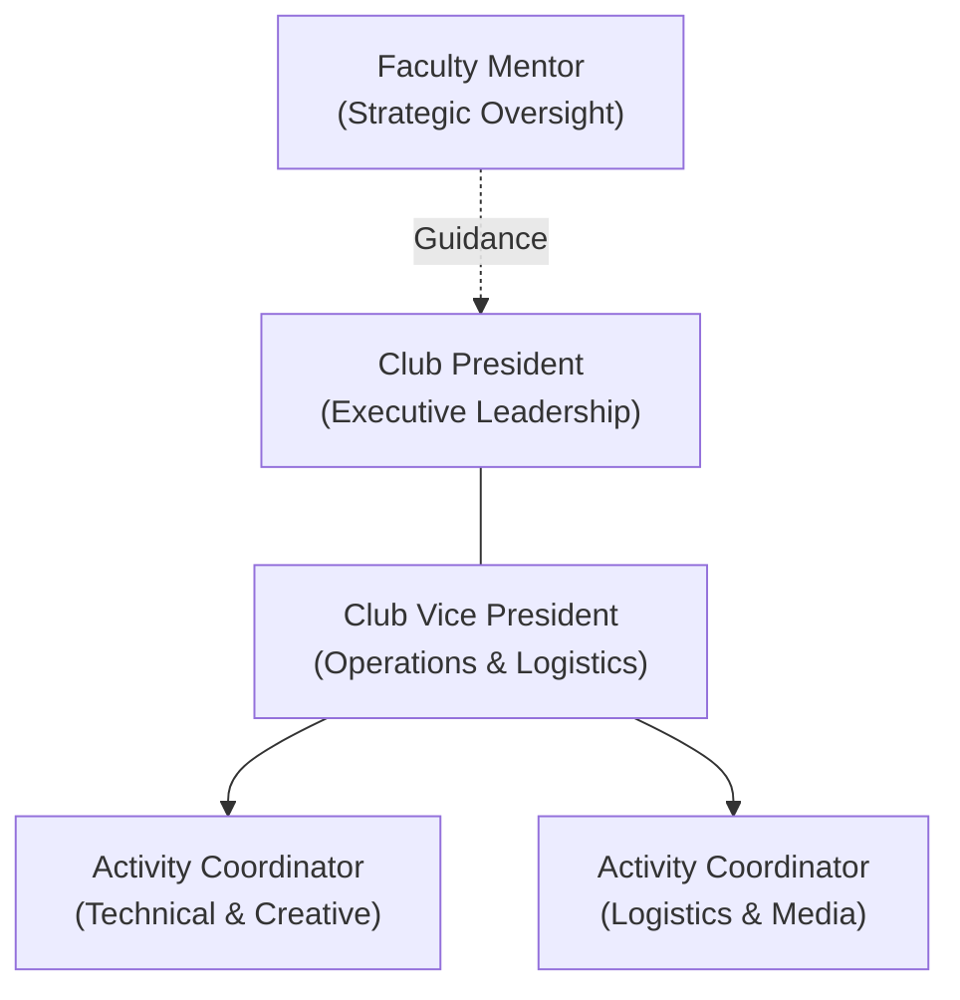

# Leadership Structure

Every club within the ecosystem is led by an executive officer board of dedicated students.

---

## 🏛️ Executive Board Organization

---

## 👥 Role Summary Table

| Role | Leadership Scope | Primary Objective |
| :--- | :--- | :--- |
| **Club President** | Overall club direction, sprint goals, external representation | Deliver high-quality monthly showcase outputs |
| **Vice President** | Day-to-day operations, roster management, session logistics | Ensure smooth sessions & accurate attendance |
| **Club Coordinators** | Activity execution, equipment setup, member support | Lead specific workshops & project sub-teams |
| **Faculty Mentor** | Strategic oversight, milestone validation, escalation | Provide expert advice & administrative backing |
