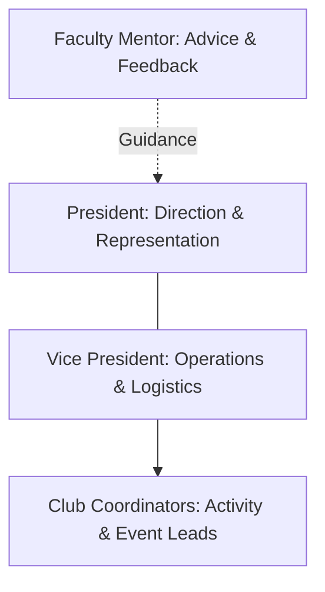

# Leadership Structure

Each club is led by a student executive team consisting of a President, Vice President, and Club Coordinators, supported by a Faculty Mentor.

Club leaders work together to plan activities, support members, and ensure the club completes its monthly showcase deliverables.
