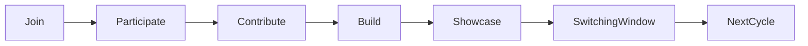

# Club Cycles & Lifecycle

Membership runs on monthly cycles. A cycle provides a common time structure for all clubs while allowing each club to independently decide its activities.

Within a cycle, a club may run a mixture of events, projects, individual learning, collaborative activities, workshops, practice sessions, discussions, and showcase preparation. The leadership of each club determines what meaningful participation and contribution looks like within their club.
