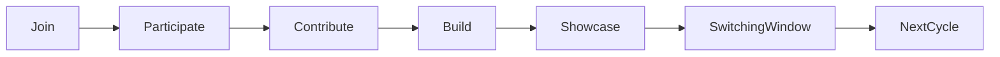

# Club Cycles & Lifecycle

Membership runs on monthly cycles. A cycle gives members enough time to learn skills, collaborate with peers, and contribute to a completed project.

The leadership of each club determines what meaningful participation and contribution looks like within their club, ensuring members experience the full learning process before considering a transfer.
