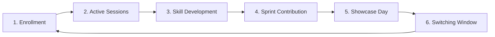

# Club Cycles & Lifecycle

Membership within the ecosystem does not follow a casual, drop-in model. Instead, participation is structured into distinct **Club Cycles**.

---

## 🔄 The 6-Phase Lifecycle Diagram

---

## ⏳ Phase Breakdown

1. **Enrollment**: Formal registration and onboarding into the selected club.
2. **Active Sessions**: Regular participation in Growth Hours workshops and discussions.
3. **Skill Development**: Acquiring hands-on technical or soft skills under coordinator guidance.
4. **Sprint Contribution**: Actively building or refining a project artifact for the monthly theme.
5. **Showcase Day**: Demonstrating completed work at the campus-wide showcase event.
6. **Switching Window**: Reflecting on the cycle and deciding whether to remain or apply for a transfer.
