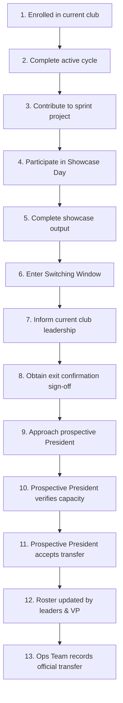

# Club Switching Protocol

The ecosystem supports structured club transfers between cycles, allowing students to explore different interest areas over time.

---

## 🚨 Strict Rules Governing Transfers

> [!CAUTION]
> - Switching is **NOT permitted** midway through an active cycle.
> - Students **cannot** abandon an active club project to join another club.
> - Transfers are valid **ONLY** during the designated window *after* Showcase Day and *before* the next session begins.

---

## 🔢 13-Step Transfer Workflow

---

## 💡 Practical Example

- **Student A** is enrolled in **Social Media Club**.
- Student A works on the monthly video podcast sprint and presents at **Showcase Day**.
- Following Showcase Day, Student A requests an exit sign-off from the Social Media VP.
- Student A approaches the President of **2D & 3D Club**, who verifies available lab capacity.
- The transfer is confirmed, rosters are updated, and Student A officially starts the next cycle in 2D & 3D Club.
