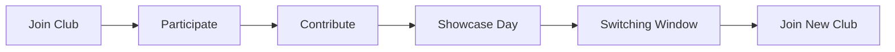

# Club Switching Protocol

Students can switch clubs between cycles to learn new skills. Switching is allowed only during the official window after Showcase Day.

## Transfer Steps

1. Complete your active cycle and showcase contribution in your current club.
2. Wait for Showcase Day to finish to enter the switching window.
3. Inform your current club leaders that you intend to switch.
4. Contact the President of the club you wish to join to confirm space.
5. Club leaders update the roster before the next session starts.
