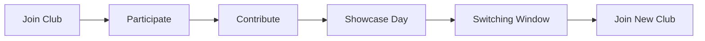

# Club Switching Protocol

Students can switch clubs to expand their skills and explore different areas. However, switching is tied to the club cycle so that students complete their current commitment before moving to another club.

## Step-by-Step Switching Sequence

1. Be enrolled in your current club.
2. Participate meaningfully during the cycle.
3. Make a meaningful contribution to your club's work.
4. Remain with the club until Showcase Day.
5. Complete your contribution to the Showcase.
6. After Showcase Day, use the period before the next club session as the switching window.
7. Inform your current club leadership that you intend to switch.
8. Approach the President of the club you want to join.
9. Current and prospective club leadership coordinate the transfer.
10. Join the new club for the next cycle.

The purpose of this system is to complete your commitment, experience the outcome, and then explore another skill area.
