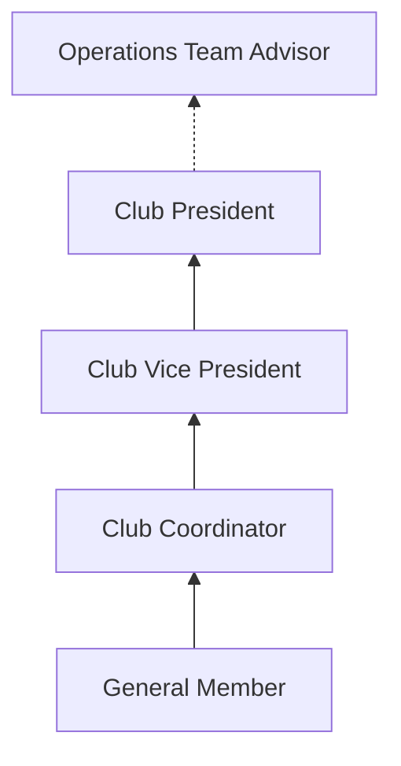

# Leadership Pathway

Every student member has the opportunity to advance into executive leadership roles within the ecosystem.

---

## 🪜 Progression Ladder

---

## 📈 Milestones for Advancement

1. **General Member → Coordinator**: Demonstrate outstanding attendance, technical initiative, and willingness to assist peers during Growth Hours.
2. **Coordinator → Vice President**: Showcase strong organizational capabilities, accurate documentation, and reliability in logistics management.
3. **Vice President → President**: Exhibit clear strategic vision, exemplary team management, and successful execution of monthly showcases.
