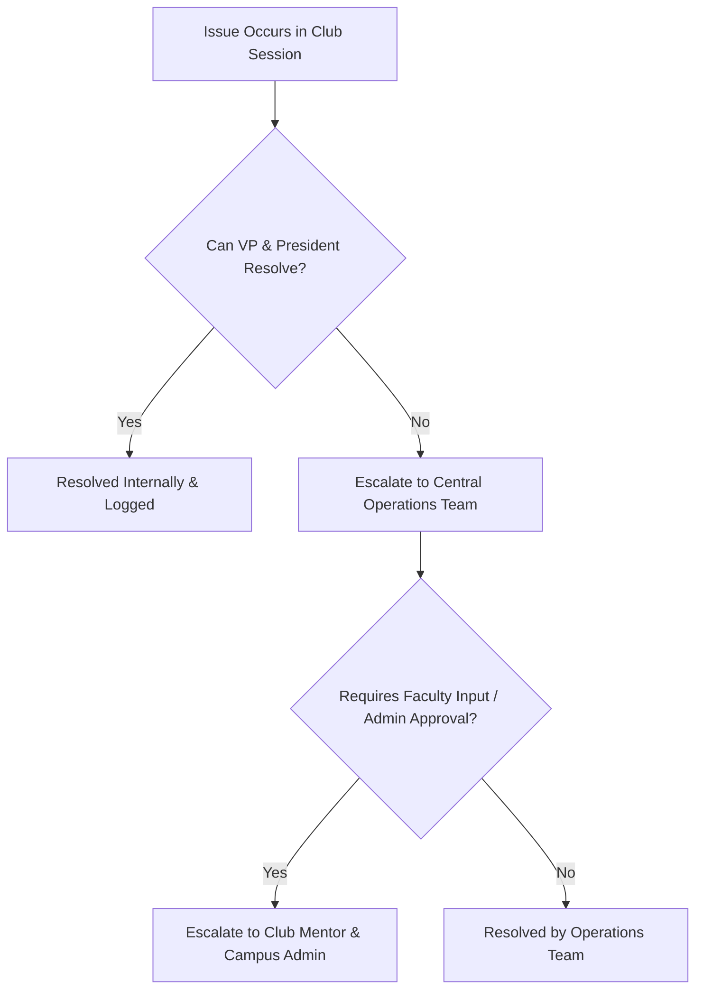

# Communication & Escalations

Clear communication channels ensure that mentors stay informed without being overloaded with routine messages.

---

## 💬 Communication Channels

- **Official Email**: Used for formal milestone approvals, sprint plan submissions, and official campus requests.
- **Dedicated Chat Groups**: Used for quick operational updates, session reminders, and urgent check-in requests.

---

## 🚨 Escalation Pathway

