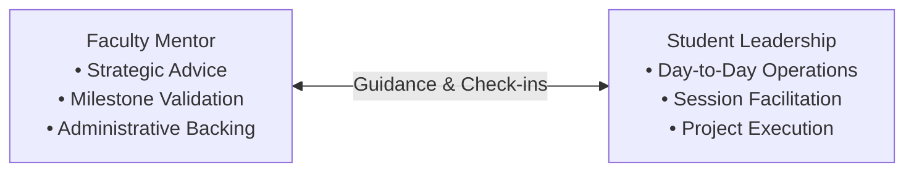

# Role of a Club Mentor

Faculty and industry mentors serve as strategic advisors and subject matter experts for the student clubs.

---

## 🎯 Strategic Objective

Mentors provide high-level wisdom, technical guidance, and institutional backing to help student leaders succeed, without stifling student initiative or ownership.

---

## 🧭 Guidance vs Execution Boundary

> [!IMPORTANT]
> **Mentors do NOT run day-to-day club operations.** Session planning, attendance tracking, and sprint management are handled entirely by elected student officers.
