# Session Cadence

During the 2-hour Growth Hours block, sessions follow a structured breakdown to maximize output and engagement.

---

## ⏱️ Standard 120-Minute Session Breakdown

```mermaid
gantt
    title Standard Growth Hours Session Timeline
    dateFormat  m
    axisFormat %m min
    Opening & Briefing       :a1, 0, 15
    Skill Workshop / Demo    :a2, 15, 45
    Hands-on Sprint Build    :a3, 45, 105
    Wrap-up & Standup Log    :a4, 105, 120
```

| Segment | Duration | Activities |
| :--- | :--- | :--- |
| **Opening Briefing** | 15 mins | Attendance check, agenda overview, sprint goal recap |
| **Skill Workshop** | 30 mins | Technical tutorial, masterclass, or topic presentation |
| **Sprint Build / Practice** | 60 mins | Hands-on project work, group debate, or gameplay |
| **Wrap-up & Standup** | 15 mins | Progress logging, action items for next session, cleanup |
