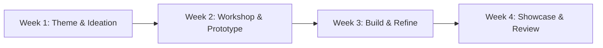

# Club Sprint Lifecycle

To ensure consistent project delivery, every club structures its monthly work into a 4-week **Sprint Lifecycle**.

---

## 🔄 4-Week Sprint Map

---

## 📋 Weekly Objectives

- **Week 1 (Ideation & Setup)**: President presents the monthly theme. Teams form and assign specific roles.
- **Week 2 (Learning & Drafting)**: Technical workshops provide required skills. Initial project drafts or speech outlines created.
- **Week 3 (Execution & Polishing)**: Intensive build phase. Assets rendered, videos edited, or debate positions finalized.
- **Week 4 (Showcase & Retrospective)**: Final presentation at Showcase Day, followed by retro logging and transfer processing.
