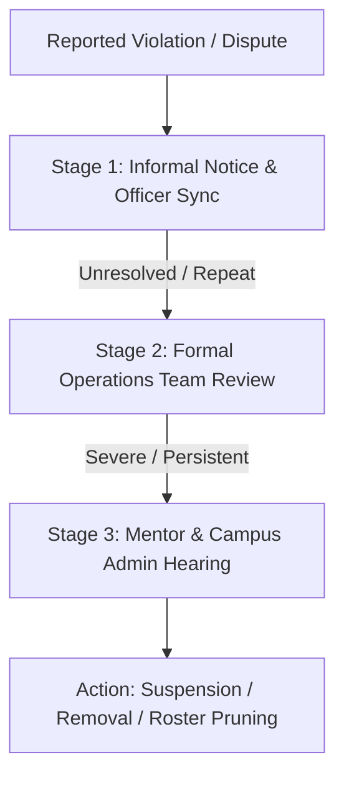

# Governance & Escalation Guidelines

When disputes, policy violations, or operational bottlenecks occur, they are managed through a structured governance framework.

---

## ⚖️ Disciplinary Framework

---

## 🛡️ Due Process & Appeals
Any member or officer subject to disciplinary action has the right to present their case to their Faculty Mentor and the Operations Team prior to final resolution.
