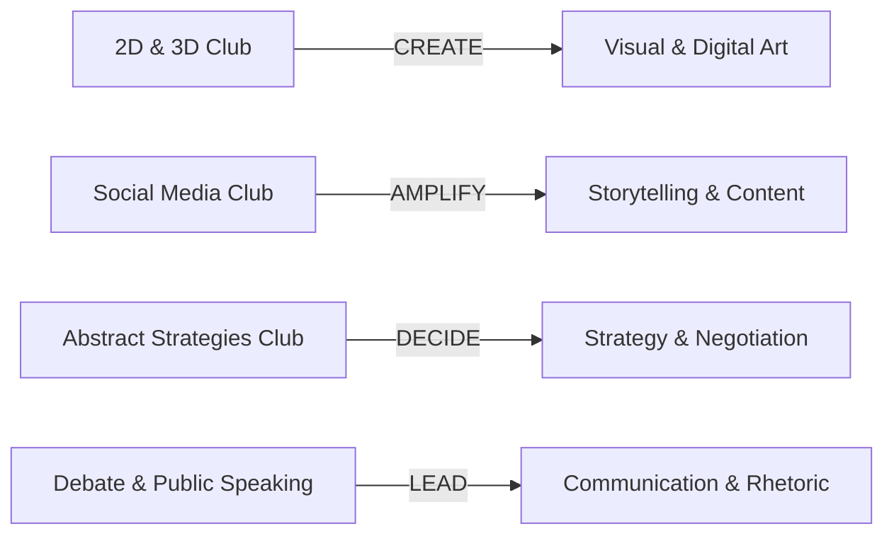

# Kalvium × Vels Student Clubs

Welcome to the official documentation portal and operating handbook for the **Kalvium × Vels Student Clubs** ecosystem. This site serves as the single source of truth for students, club leaders, mentors, operations coordinators, and campus management.

> [!NOTE]
> **Official Handbook Version 1.0**
> This repository is synchronized live with GitBook. It outlines governance, club operations, leadership workflows, growth hours, and membership protocols.

---

## 🚀 Quick Navigation

| Section | Overview & Key Topics |
| :--- | :--- |
| [**01. Introduction**](01-introduction/README.md) | Welcome, About the Ecosystem, Vision & Purpose, Growth Pillars |
| [**02. Club Ecosystem**](02-club-ecosystem/README.md) | Overview of active clubs (2D & 3D, Social Media, Abstract Strategies, Debate & Public Speaking) & Inter-Club Collaboration |
| [**03. Operations**](03-operations/README.md) | Operations Team, Decision Framework, Campus Coordination & Google Workspace Automation |
| [**04. Club Leadership**](04-club-leadership/README.md) | Executive Structure (Presidents, VPs, Coordinators), Selection Process & Deliverables |
| [**05. Membership & Lifecycle**](05-membership/README.md) | Joining, Club Cycles, One-Club-Only Policy & Club Switching Protocol |
| [**06. Mentorship**](06-mentorship/README.md) | Role of Club Mentors, Responsibilities, Student–Mentor Working Model & Escalations |
| [**07. Scheduling & Activities**](07-scheduling-activities/README.md) | Growth Hours, Sprint Lifecycle, Monthly Showcase Day & Event Planning |
| [**08. Guidelines & Governance**](08-guidelines/README.md) | Code of Conduct, Communication Rules, Brand Guidelines & Information Ethics |
| [**09. Documentation & Artifacts**](09-documentation/README.md) | Project Repositories, Monthly Retrospectives, Showcase Archive & Wall of Fame |
| [**10. Resources & Templates**](10-resources/README.md) | Official Forms, Transfer Applications, Slide Decks, Brand Kits & Essential Links |

---

## 🎯 Core Philosophy & Purpose

The ecosystem operates around four foundational action pillars:

- **2D & 3D Club**: *CREATE* — Visual creativity, design, game dev, digital art, animation, and rendering.
- **Social Media Club**: *TELL / AMPLIFY* — Content production, filmmaking, podcasts, digital media, and public growth campaigns.
- **Abstract Strategies Club**: *THINK / DECIDE* — Strategic decision-making, game theory, negotiation, marketing, and business strategy.
- **Debate & Public Speaking Club**: *COMMUNICATE / LEAD* — Public speaking, argumentation, pitching, rhetoric, stage presence, and confidence.

---

## 📋 Essential Policies At A Glance

> [!IMPORTANT]
> - **One-Club-Only Policy**: Students may actively belong to only **ONE** club during an active cycle.
> - **Club Switching Protocol**: Transfers are permitted **only** during the designated window *after* Showcase Day and *before* the next cycle starts, requiring contribution sign-off from current leaders and acceptance by the prospective club President.
> - **Growth Hours Disclaimer**: Proposed activity hours (Tue/Thu 4–6 PM & working Saturdays) are subject to campus approval and academic timetable integration.

---

## 📖 Navigation Summary
For a complete index of all pages, visit the [**GitBook Navigation Index (SUMMARY.md)**](SUMMARY.md).
