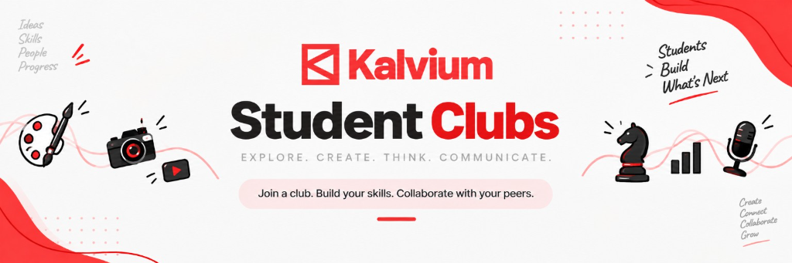

# Welcome & Ecosystem Overview

The Kalvium x Vels Student Clubs ecosystem was created to give students dedicated time and space to develop practical skills outside traditional coursework. Through peer collaboration, events, project builds, and monthly showcases, students create tangible work while gaining team and leadership experience.

This handbook is the official operating reference for students, club leaders, mentors, and campus management. It details the common framework that maintains ecosystem consistency while encouraging individual clubs to build their own culture, projects, and activities.

## Core Purpose & Skill Development

Rather than sitting through passive presentations, club members spend session time actively building, writing, analyzing, debating, designing, or hosting events. This approach ensures that members gain practical experience during each monthly cycle.

The work created during club sessions serves as concrete evidence of your skills. Completed game prototypes, UI kits, media campaigns, case analyses, and recorded keynotes contribute directly to student portfolios for future career opportunities.

## Core Principle: Framework, Not Limitation

The framework establishes the common structure of the Student Clubs. It does not limit what students or club leaders can create, organize, explore, or experiment with.

The central framework defines common rules: what clubs exist, enrollment procedures, the One-Club-Only policy, the monthly Club Cycle, Showcase Day, the Club Switching Window, basic leadership roles, and Growth Hours timing. Within those boundaries, each club leadership team and its members have full freedom to propose, design, and run their own activities, workshops, projects, discussions, events, and learning experiences.

## The Four Active Clubs

The ecosystem consists of four active clubs:

- **2D & 3D Club**: Focuses on visual design, digital art, UI/UX, 2D animation, game development, 3D modeling, rendering, and visual problem solving.
- **Social Media Club**: Focuses on content production, storytelling, podcasting, videography, video editing, poster design, filmmaking, media management, and platform growth.
- **Abstract Strategies Club**: Focuses on strategic thinking, decision-making, problem-solving, game theory, business strategy, negotiation tactics, and financial reasoning.
- **Debate & Public Speaking Club**: Focuses on communication, public speaking, structured argumentation, presentation skills, pitching, rhetoric, confidence, and stage presence.

## Getting Started

Explore the active clubs in the [Club Ecosystem](../02-club-ecosystem/index.md) section to find the community that aligns best with your goals. When you are ready to join, review [Joining & Member Expectations](../05-membership/index.md) for enrollment details.
